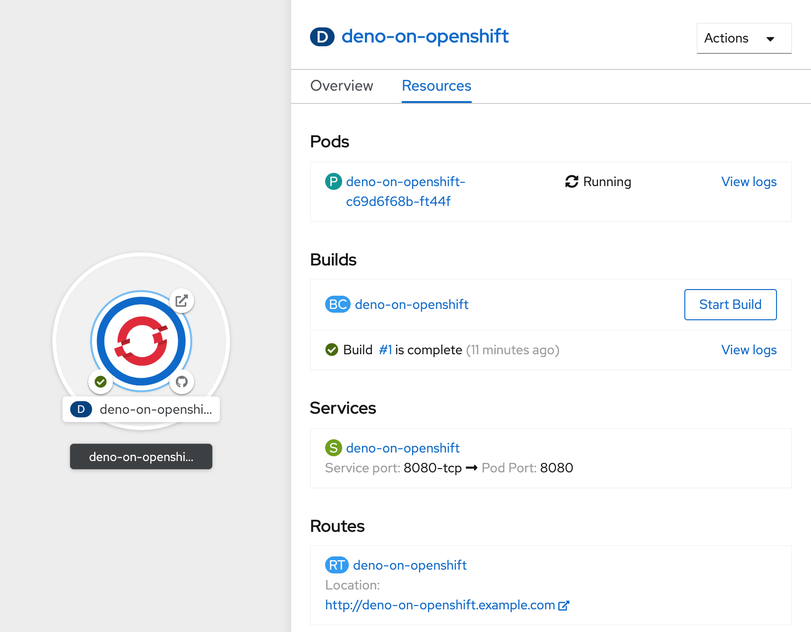

# Deno server that runs on OpenShift

Small server written in TypeScript that runs on OpenShift with Deno.



## Running local

### Simple

Prerequisite: Deno runtime: https://deno.land/#installation

```sh
deno run --allow-net server.ts
```

#### Alternative using [Makefile](./Makefile)

```sh
make run
```

### With docker

```sh
make docker-run
```

## OpenShift

1. Create a project ([docs](https://docs.openshift.com/container-platform/latest/applications/projects/working-with-projects.html#odc-creating-projects-using-developer-perspective_projects))
2. Create application ([docs](https://docs.openshift.com/container-platform/latest/applications/application_life_cycle_management/odc-creating-applications-using-developer-perspective.html))

- Choose _From Dockerfile_
- Use the URL of this repository (`https://github.com/dbrugger/deno-on-openshift`)
- Keep defaults for the rest
- Create.
- That's it. OpenShift will:
  - pull the code from the Git repository
  - build the image using the [Dockerfile](./Dockerfile)
  - push the image to the built-in registry
  - create the `Deployment`
  - create the `Service`
  - create the `Route`
